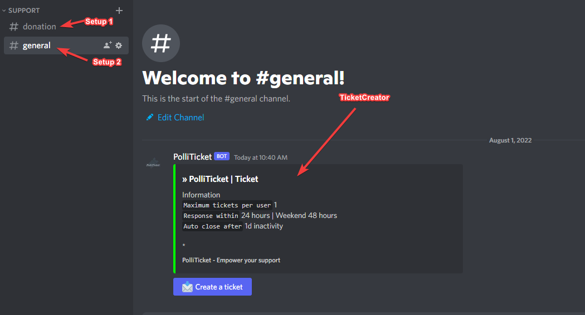
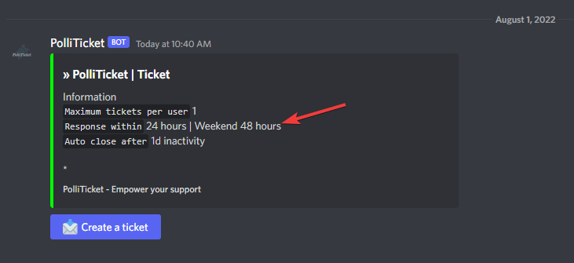

# Setup

You have already learned **how to invite the bot**, now we come to the setup that can be done multiple times.

## Begin

To be able to start a setup at all, you **need** the permission **ADMINISTRATOR**.
The command to start the setup is `/setup`, the individual options are explained in more detail here.

**What is a TicketCreator?** 

## Setup options

Anything **unclear** or **buggy** in this part? **[Please report it!](https://github.com/xiLight/PolliTicketDocs/issues/new/choose)**

### language

:::caution
This is a `required` field and must be filled out.
:::

Here you have to select the language the bot uses for the tickets via a dropdown.
You can always make one setup per TicketCreator, which means that you could also make different TicketCreators, 
such as an English section and a German section or General Support and Donation Support.

### timezone

:::caution
This is a `required` field and must be filled out.
:::

Here you have to enter a time zone ID so that the bot knows how to handle your time.
Because there are many time zone IDs, I have selected the most common time zones.

`Most common timezones:` UTC, Europe/Berlin

Timezones (600+)

ACT
AET
AGT
ART
AST
Africa/Abidjan
Africa/Accra
Africa/Addis_Ababa
Africa/Algiers
Africa/Asmara
Africa/Asmera
Africa/Bamako
Africa/Bangui
Africa/Banjul
Africa/Bissau
Africa/Blantyre
Africa/Brazzaville
Africa/Bujumbura
Africa/Cairo
Africa/Casablanca
Africa/Ceuta
Africa/Conakry
Africa/Dakar
Africa/Dar_es_Salaam
Africa/Djibouti
Africa/Douala
Africa/El_Aaiun
Africa/Freetown
Africa/Gaborone
Africa/Harare
Africa/Johannesburg
Africa/Juba
Africa/Kampala
Africa/Khartoum
Africa/Kigali
Africa/Kinshasa
Africa/Lagos
Africa/Libreville
Africa/Lome
Africa/Luanda
Africa/Lubumbashi
Africa/Lusaka
Africa/Malabo
Africa/Maputo
Africa/Maseru
Africa/Mbabane
Africa/Mogadishu
Africa/Monrovia
Africa/Nairobi
Africa/Ndjamena
Africa/Niamey
Africa/Nouakchott
Africa/Ouagadougou
Africa/Porto-Novo
Africa/Sao_Tome
Africa/Timbuktu
Africa/Tripoli
Africa/Tunis
Africa/Windhoek
America/Adak
America/Anchorage
America/Anguilla
America/Antigua
America/Araguaina
America/Argentina/Buenos_Aires
America/Argentina/Catamarca
America/Argentina/ComodRivadavia
America/Argentina/Cordoba
America/Argentina/Jujuy
America/Argentina/La_Rioja
America/Argentina/Mendoza
America/Argentina/Rio_Gallegos
America/Argentina/Salta
America/Argentina/San_Juan
America/Argentina/San_Luis
America/Argentina/Tucuman
America/Argentina/Ushuaia
America/Aruba
America/Asuncion
America/Atikokan
America/Atka
America/Bahia
America/Bahia_Banderas
America/Barbados
America/Belem
America/Belize
America/Blanc-Sablon
America/Boa_Vista
America/Bogota
America/Boise
America/Buenos_Aires
America/Cambridge_Bay
America/Campo_Grande
America/Cancun
America/Caracas
America/Catamarca
America/Cayenne
America/Cayman
America/Chicago
America/Chihuahua
America/Coral_Harbour
America/Cordoba
America/Costa_Rica
America/Creston
America/Cuiaba
America/Curacao
America/Danmarkshavn
America/Dawson
America/Dawson_Creek
America/Denver
America/Detroit
America/Dominica
America/Edmonton
America/Eirunepe
America/El_Salvador
America/Ensenada
America/Fort_Wayne
America/Fortaleza
America/Glace_Bay
America/Godthab
America/Goose_Bay
America/Grand_Turk
America/Grenada
America/Guadeloupe
America/Guatemala
America/Guayaquil
America/Guyana
America/Halifax
America/Havana
America/Hermosillo
America/Indiana/Indianapolis
America/Indiana/Knox
America/Indiana/Marengo
America/Indiana/Petersburg
America/Indiana/Tell_City
America/Indiana/Vevay
America/Indiana/Vincennes
America/Indiana/Winamac
America/Indianapolis
America/Inuvik
America/Iqaluit
America/Jamaica
America/Jujuy
America/Juneau
America/Kentucky/Louisville
America/Kentucky/Monticello
America/Knox_IN
America/Kralendijk
America/La_Paz
America/Lima
America/Los_Angeles
America/Louisville
America/Lower_Princes
America/Maceio
America/Managua
America/Manaus
America/Marigot
America/Martinique
America/Matamoros
America/Mazatlan
America/Mendoza
America/Menominee
America/Merida
America/Metlakatla
America/Mexico_City
America/Miquelon
America/Moncton
America/Monterrey
America/Montevideo
America/Montreal
America/Montserrat
America/Nassau
America/New_York
America/Nipigon
America/Nome
America/Noronha
America/North_Dakota/Beulah
America/North_Dakota/Center
America/North_Dakota/New_Salem
America/Ojinaga
America/Panama
America/Pangnirtung
America/Paramaribo
America/Phoenix
America/Port-au-Prince
America/Port_of_Spain
America/Porto_Acre
America/Porto_Velho
America/Puerto_Rico
America/Rainy_River
America/Rankin_Inlet
America/Recife
America/Regina
America/Resolute
America/Rio_Branco
America/Rosario
America/Santa_Isabel
America/Santarem
America/Santiago
America/Santo_Domingo
America/Sao_Paulo
America/Scoresbysund
America/Shiprock
America/Sitka
America/St_Barthelemy
America/St_Johns
America/St_Kitts
America/St_Lucia
America/St_Thomas
America/St_Vincent
America/Swift_Current
America/Tegucigalpa
America/Thule
America/Thunder_Bay
America/Tijuana
America/Toronto
America/Tortola
America/Vancouver
America/Virgin
America/Whitehorse
America/Winnipeg
America/Yakutat
America/Yellowknife
Antarctica/Casey
Antarctica/Davis
Antarctica/DumontDUrville
Antarctica/Macquarie
Antarctica/Mawson
Antarctica/McMurdo
Antarctica/Palmer
Antarctica/Rothera
Antarctica/South_Pole
Antarctica/Syowa
Antarctica/Troll
Antarctica/Vostok
Arctic/Longyearbyen
Asia/Aden
Asia/Almaty
Asia/Amman
Asia/Anadyr
Asia/Aqtau
Asia/Aqtobe
Asia/Ashgabat
Asia/Ashkhabad
Asia/Baghdad
Asia/Bahrain
Asia/Baku
Asia/Bangkok
Asia/Beirut
Asia/Bishkek
Asia/Brunei
Asia/Calcutta
Asia/Chita
Asia/Choibalsan
Asia/Chongqing
Asia/Chungking
Asia/Colombo
Asia/Dacca
Asia/Damascus
Asia/Dhaka
Asia/Dili
Asia/Dubai
Asia/Dushanbe
Asia/Gaza
Asia/Harbin
Asia/Hebron
Asia/Ho_Chi_Minh
Asia/Hong_Kong
Asia/Hovd
Asia/Irkutsk
Asia/Istanbul
Asia/Jakarta
Asia/Jayapura
Asia/Jerusalem
Asia/Kabul
Asia/Kamchatka
Asia/Karachi
Asia/Kashgar
Asia/Kathmandu
Asia/Katmandu
Asia/Khandyga
Asia/Kolkata
Asia/Krasnoyarsk
Asia/Kuala_Lumpur
Asia/Kuching
Asia/Kuwait
Asia/Macao
Asia/Macau
Asia/Magadan
Asia/Makassar
Asia/Manila
Asia/Muscat
Asia/Nicosia
Asia/Novokuznetsk
Asia/Novosibirsk
Asia/Omsk
Asia/Oral
Asia/Phnom_Penh
Asia/Pontianak
Asia/Pyongyang
Asia/Qatar
Asia/Qyzylorda
Asia/Rangoon
Asia/Riyadh
Asia/Riyadh87
Asia/Riyadh88
Asia/Riyadh89
Asia/Saigon
Asia/Sakhalin
Asia/Samarkand
Asia/Seoul
Asia/Shanghai
Asia/Singapore
Asia/Srednekolymsk
Asia/Taipei
Asia/Tashkent
Asia/Tbilisi
Asia/Tehran
Asia/Tel_Aviv
Asia/Thimbu
Asia/Thimphu
Asia/Tokyo
Asia/Ujung_Pandang
Asia/Ulaanbaatar
Asia/Ulan_Bator
Asia/Urumqi
Asia/Ust-Nera
Asia/Vientiane
Asia/Vladivostok
Asia/Yakutsk
Asia/Yekaterinburg
Asia/Yerevan
Atlantic/Azores
Atlantic/Bermuda
Atlantic/Canary
Atlantic/Cape_Verde
Atlantic/Faeroe
Atlantic/Faroe
Atlantic/Jan_Mayen
Atlantic/Madeira
Atlantic/Reykjavik
Atlantic/South_Georgia
Atlantic/St_Helena
Atlantic/Stanley
Australia/ACT
Australia/Adelaide
Australia/Brisbane
Australia/Broken_Hill
Australia/Canberra
Australia/Currie
Australia/Darwin
Australia/Eucla
Australia/Hobart
Australia/LHI
Australia/Lindeman
Australia/Lord_Howe
Australia/Melbourne
Australia/NSW
Australia/North
Australia/Perth
Australia/Queensland
Australia/South
Australia/Sydney
Australia/Tasmania
Australia/Victoria
Australia/West
Australia/Yancowinna
BET
BST
Brazil/Acre
Brazil/DeNoronha
Brazil/East
Brazil/West
CAT
CET
CNT
CST
CST6CDT
CTT
Canada/Atlantic
Canada/Central
Canada/East-Saskatchewan
Canada/Eastern
Canada/Mountain
Canada/Newfoundland
Canada/Pacific
Canada/Saskatchewan
Canada/Yukon
Chile/Continental
Chile/EasterIsland
Cuba
EAT
ECT
EET
EST
EST5EDT
Egypt
Eire
Etc/GMT
Etc/GMT+0
Etc/GMT+1
Etc/GMT+10
Etc/GMT+11
Etc/GMT+12
Etc/GMT+2
Etc/GMT+3
Etc/GMT+4
Etc/GMT+5
Etc/GMT+6
Etc/GMT+7
Etc/GMT+8
Etc/GMT+9
Etc/GMT-0
Etc/GMT-1
Etc/GMT-10
Etc/GMT-11
Etc/GMT-12
Etc/GMT-13
Etc/GMT-14
Etc/GMT-2
Etc/GMT-3
Etc/GMT-4
Etc/GMT-5
Etc/GMT-6
Etc/GMT-7
Etc/GMT-8
Etc/GMT-9
Etc/GMT0
Etc/Greenwich
Etc/UCT
Etc/UTC
Etc/Universal
Etc/Zulu
Europe/Amsterdam
Europe/Andorra
Europe/Athens
Europe/Belfast
Europe/Belgrade
Europe/Berlin
Europe/Bratislava
Europe/Brussels
Europe/Bucharest
Europe/Budapest
Europe/Busingen
Europe/Chisinau
Europe/Copenhagen
Europe/Dublin
Europe/Gibraltar
Europe/Guernsey
Europe/Helsinki
Europe/Isle_of_Man
Europe/Istanbul
Europe/Jersey
Europe/Kaliningrad
Europe/Kiev
Europe/Lisbon
Europe/Ljubljana
Europe/London
Europe/Luxembourg
Europe/Madrid
Europe/Malta
Europe/Mariehamn
Europe/Minsk
Europe/Monaco
Europe/Moscow
Europe/Nicosia
Europe/Oslo
Europe/Paris
Europe/Podgorica
Europe/Prague
Europe/Riga
Europe/Rome
Europe/Samara
Europe/San_Marino
Europe/Sarajevo
Europe/Simferopol
Europe/Skopje
Europe/Sofia
Europe/Stockholm
Europe/Tallinn
Europe/Tirane
Europe/Tiraspol
Europe/Uzhgorod
Europe/Vaduz
Europe/Vatican
Europe/Vienna
Europe/Vilnius
Europe/Volgograd
Europe/Warsaw
Europe/Zagreb
Europe/Zaporozhye
Europe/Zurich
GB
GB-Eire
GMT
GMT0
Greenwich
HST
Hongkong
IET
IST
Iceland
Indian/Antananarivo
Indian/Chagos
Indian/Christmas
Indian/Cocos
Indian/Comoro
Indian/Kerguelen
Indian/Mahe
Indian/Maldives
Indian/Mauritius
Indian/Mayotte
Indian/Reunion
Iran
Israel
JST
Jamaica
Japan
Kwajalein
Libya
MET
MIT
MST
MST7MDT
Mexico/BajaNorte
Mexico/BajaSur
Mexico/General
Mideast/Riyadh87
Mideast/Riyadh88
Mideast/Riyadh89
NET
NST
NZ
NZ-CHAT
Navajo
PLT
PNT
PRC
PRT
PST
PST8PDT
Pacific/Apia
Pacific/Auckland
Pacific/Bougainville
Pacific/Chatham
Pacific/Chuuk
Pacific/Easter
Pacific/Efate
Pacific/Enderbury
Pacific/Fakaofo
Pacific/Fiji
Pacific/Funafuti
Pacific/Galapagos
Pacific/Gambier
Pacific/Guadalcanal
Pacific/Guam
Pacific/Honolulu
Pacific/Johnston
Pacific/Kiritimati
Pacific/Kosrae
Pacific/Kwajalein
Pacific/Majuro
Pacific/Marquesas
Pacific/Midway
Pacific/Nauru
Pacific/Niue
Pacific/Norfolk
Pacific/Noumea
Pacific/Pago_Pago
Pacific/Palau
Pacific/Pitcairn
Pacific/Pohnpei
Pacific/Ponape
Pacific/Port_Moresby
Pacific/Rarotonga
Pacific/Saipan
Pacific/Samoa
Pacific/Tahiti
Pacific/Tarawa
Pacific/Tongatapu
Pacific/Truk
Pacific/Wake
Pacific/Wallis
Pacific/Yap
Poland
Portugal
ROK
SST
Singapore
SystemV/AST4
SystemV/AST4ADT
SystemV/CST6
SystemV/CST6CDT
SystemV/EST5
SystemV/EST5EDT
SystemV/HST10
SystemV/MST7
SystemV/MST7MDT
SystemV/PST8
SystemV/PST8PDT
SystemV/YST9
SystemV/YST9YDT
Turkey
UCT
US/Alaska
US/Aleutian
US/Arizona
US/Central
US/East-Indiana
US/Eastern
US/Hawaii
US/Indiana-Starke
US/Michigan
US/Mountain
US/Pacific
US/Pacific-New
US/Samoa
UTC
Universal
VST
W-SU
WET
Zulu

### use-transcripts

:::caution
This is a `required` field and must be filled out.
:::

PolliTicket offers you to respect your privacy and still have an archive!
A dropdown must be used to select between `true`and `false`.

`true` A transcript is created after the ticket close and saved online. 
`false` The ticket content is **not** saved, but the ticket is moved to an archive category for 7 days that can only be seen by the admin.

### category-name

:::caution
This is a `required` field and must be filled out.
:::

Here you have to think of a name for the category,
if the name already exists, the ticket creator (channel name) will be filed under the existing category.

Thus, it is possible to complete several setups in order to divide the support into areas.

You should use - for spaces. 
**Example:** `ticket-area` instanceof `ticket area`

### channel-name

:::caution
This is a `required` field and must be filled out.
:::

Here you have to think of a name for the ticket-creator channel.
You should use - for spaces. 
**Example:** `create-ticket` instanceof `create ticket`

### team-role

:::caution
This is a `required` field and must be filled out.
:::

A dropdown is used to select the supporter role that has the right to close and claim a ticket.
Roles with administrator permission see channel even without supporter role.

### ping-role

:::caution
This is a `required` field and must be filled out.
:::

Via a drop-down menu, you can select the ping role that will be pinged as soon as a new ticket has been created.
The owner of the ticket is always pinged.

### max-tickets-per-user

:::caution
This is a `required` field and must be filled out.
:::

Here you can limit how many tickets a user may have in the TicketCreator at the same time.
More than 1 is not recommended.

### response-within-label

:::caution
This is a `required` field and must be filled out.
:::

We offer you to indicate how long you need to answer the ticket. Here, a string is expected as an answer.

### auto-close-time

:::caution
This is a `required` field and must be filled out.
:::

Here you can decide when the tickets should be closed automatically if there is no response after x days or x hours. 
**Examples:** 
`» 1 week & 5 days:` 1w5d  
`» 1 day:` 1d  
`» 1 week:` 1w  
`» 8 hours:` 8h  

We recommend `3d` 3 days. After 3 days without a reply, one can assume that the support issue has been resolved.

### custom-text

:::caution
This option is optional and does not need to be completed. The word `skip` can be used to skip this step.
:::

If you would like to give your TicketCreator a beautiful custom text, then you have come to the right place.

You can create your own description, which will be placed under the info.
**Maximum 300 characters** allowed.
I would recommend presetting the description, because it must be written in one line.
A new line in the description is written by `\n`

TODO IMAGE

### embed-image-url

:::caution
This option is optional and does not need to be completed. The word `skip` can be used to skip this step.
:::

If you want a nice image at the bottom of the footer of the embed, you can enter a full link here.
Please make sure that you enter the **full** link with `https://`

**Allowed endings:** `.jpg` `.jpeg` `.gif` `.png` `.bmp`
